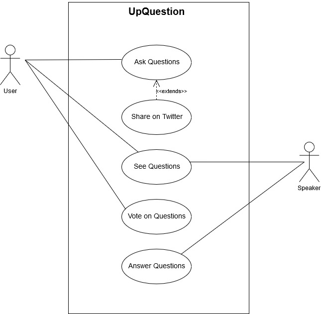

# openCX Development Report

Welcome to the documentation pages of the **openCX- UpQuestion** project!

You can find here detailed information about the project, from a high-level product vision to low-level implementation decisions, organized as a kind of Software Development Report 

* #### Business modeling

    *  [Product Vision](#Product-Vision)

    *  [Elevator Pitch](#Elevator-Pitch)

* #### Requirements

    *  [Use Case Diagram](#Use-case-diagram)

    *  [User stories](#User-stories)

    * [Mockups](#Mockups)

* #### Architectural Structure
    * [MVC](#Architectural-Structure)
    * [Backend](#Backend)
         * [Firebase](#Backend)
         * Twitter API
    
 
* #### Tasks Management Tool

***

So far, contributions are exclusively made by the initial Goal Diggers team, but we hope to open them to the community, in all areas and topics: requirements, technologies, development, experimentation, testing, etc.

Please contact us!

Thank you!

Team Members:
  - [André Gomes](https://github.com/andremsgomes)
  - [Manuel Coutinho](https://github.com/ManelCoutinho) 
  - [Roberto Mourato](https://github.com/RobertoMourato)
  - [Ruben Almeida](https://github.com/arubenruben) 
  - [Tiago Silva](https://github.com/tiagogsilva) 

***

## Product Vision

To make great questions heard (by the speaker)

## Elevator Pitch

Tired of the long awkward silences when speaker asks "Any questions??"; Tired of hearing the front line old lady telling her life story taking up your question space? Don't worry!! Send us your questions and upvote your favorites. Make your voice heard without the hassle of waiting for a mic.

## Requirements

UpQuestion was designed to end up with the inefficient experience of the participants in a conference at the end moment when questions are made/answered.

The main stakeholders identified in the given context are:

* The Participant- Person who attend to listen the speaker in   a certain talk. Has the capability to Submit questions and   to upvote other participants questions he thinks deserve     being answered.

* The Speaker- Person expert on the subject who performs the   talk. Has limited time to answer an, also, limited number     of questions and intend to invest that time to answer the     most interesting questions.

We believe that a communitarian forum open to all conference participants with features of upvote is our greatest ally to cluster the greatest questions, those that will be answered in that limited period.

A more detailed analysis of this topic is made below targeting RUP & AGILE methodologies of requirement engineering:

### Use case diagram 

#### Ask Questions
* **Actor**. Any user attending a lecture.
* **Description**. The purpose of this use case is to make questions and saving all of them on a list
* **Preconditions and Postconditions**. Users first need to login, which they can do using twitter. Then they need to choose from the schedule the lecture they are attending. Finally they need to click the plus button. In the end the system will add the question to the list. When the lecture is over, users can't ask questions anymore.
* **Normal Flow**. After the plus button is clicked, the system will open a pop-up with a box for a user to write a question. Then the user can click on the button to share the question and the system will close the pop-up and add the question to the list.
* **Alternative Flows and Exceptions**. In the pop-up there is a checkout box that, when clicked, the user will be able to share the question anonymously. There is also another button to share the question, that will share it also with twitter. If the user is not logged in with twitter, the system will show an error message.

#### See Questions
* **Actors**. Any user attending a lecture and the speaker who is giving it.
* **Description**. The purpose of this use case is to make all the questions visible for everyone who is in the lecture.
* **Preconditions and Postconditions**. Users first need to login, which they can do using twitter. Then they need to choose from the schedule the lecture they are attending. All the questions can be seen even after the lecture is over.
* **Normal Flow**. After choosing the lecture from the schedule, the system shows a list of all the questions made at the moment, sorted by number of votes. The system is always updating this list, as more questions are made.
* **Alternative Flows and Exceptions**. The sorting can be changed by the user, when clicked the sorting dropdown box. It allows the user to select from 'Top', 'Trending' and 'New', to which the system will update the questions order, based on the option selected.

#### Vote on Questions
* **Actor**. Any user attending a lecture.
* **Description**. The purpose of this use case is to be able to vote on the questions.
* **Preconditions and Postconditions**. Users first need to login, which they can do using twitter. Then they need to choose from the schedule the lecture they are attending. When the lecture is over, users can't vote on the questions anymore.
* **Normal Flow**. After choosing the lecture from the schedule, the system shows a list of all the questions made at the moment, sorted by number of votes. Users can click on upvote and downvote on all the questions and the system will update the number of votes and the order of the list.

#### Answer Questions
* **Actor**. The speaker who is giving the lecture.
* **Description**. The purpose of this use case is to be able to answer the questions.
* **Preconditions and Postconditions**. Speakers first need to login, which they can do using twitter. Then they need to choose from the schedule the lecture they are giving.
* **Normal Flow**. After choosing the lecture from the schedule, the system shows a list of all the questions made at the moment, sorted by number of votes. At the end of each lecture, speakers can answer this questions to clarify the audience.
* **Alternative Flows and Exceptions**. After the lecture is over, speaker can answer the questions, by clicking on the comment button of a giving question.

 *Fig.1: User Case Diagram*

### User stories

We are using Trello to keep track of the user stories in the state of:

* Planed of (Backlog)
* Under Work (Doing)  
* Done. 

You have a [link](#Tasks-Management-Tools) to check all the dashboard bellow, but here we brief you that information with a screenshot of our Trello's user stories organization. 

A exampling picture of the status of our Trello organization is the following:

#### First sprint

&nbsp;In the first sprint our focus was on implementing the prototype. That demanded to architecture the future design under we would code into, an MVC one, using a local DataBase, implement the UI designed in the mockups from the inception phase, which means we built the prototype with the fundations required for many of the user stories with the greastest interaction with the user such as login

In terms of user stories, we implemented the following: [Iteration #1](https://trello.com/b/08Qa7QyI/esofupquestion?menu=filter&filter=label:Iteration1) 

#### Second sprint

&nbsp;The second iteration we project from the results of [Iteration #1](https://trello.com/b/08Qa7QyI/esofupquestion?menu=filter&filter=label:Iteration1) . We decide to implement a firebase backend, according the reasons stated here, that required to redefine the implementation of the user stories completed in the first iteration to work using a real time database as firebase. 

Furthermore, we decide to move forward and implement in the following user stories: [Iteration #2](https://trello.com/b/08Qa7QyI/esofupquestion?menu=filter&filter=label:Iteration2)

#### Third sprint
&nbsp;The third iteration focused on the development of the reply capability to any question previously made, the integration of the twitter’s related capabilities and also the the implementation of constrains to the register form. 

&nbsp;In UpQuestion at the time of the third iteration, only the speaker has the capability to reply to questions. Furthermore, that capability is constrained to talks where he responsible for. In order to increment this feature, it was necessary to include the capability to distinguish a simple user from a speaker. In order to achieve that objective, a special speaker-login system based on a code stored in the database was designed.

&nbsp;The implementation of restrictions to the register form parameters (username, password and email) was also achieved supported in the REGEX embedded libraries offered by flutter. 
About the twitter’s subject, we were unable to achieve any progress on that, since the Twitter API key wasn´t released in time by the Twitter team. We look forward to implementing them as soon as the mention key would be released.

##### The original plan is represented in the following Trello schedule:

Link to the iteration 3 tag on Trello: [Here](https://trello.com/b/08Qa7QyI/esofupquestion?menu=filter&filter=label:Sprint%203%20-%2022%20de%20novembro).

 ### Mockups
 
 The mockups for this project were developed in Figma and can be found [here](https://www.figma.com/file/BlnF2GOIbviAUOwevrIHnR/UpQuestion?node-id=0%3A1). 
   (or, as an alternative, in the folder [mockups](https://github.com/softeng-feup/open-cx-goal-diggers/tree/master/docs/mockups) of this directory)

 
## Architectural Structure

### MVC
&nbsp; We are developing code bearing in mind the MVC architectural structure. At the time of this first report, it is revealing itself harder than we anticipated the division between the View and Controller due to the code structures that Flutter implies. More refactoring will be done in the next iterations.

### Backend

&nbsp; An application as UpQuestion with the aim of manipulate multiple questions in different talks will generate a huge amount of data easily. Furthermore, for testing purposes, a local static database is a nonsense further than the prototyping phase. The effective test to evaluate the practicability of our design is made submitting plenty of questions, and, then, manipulate it simulating the role of user and speaker.

&nbsp; For these reasons, we decided to move forward and integrate in our Flutter App an online backend software that could resolve the greatest number of user stories as possible. The decision made was integrate Firebase from Google(same producer of Flutter).

&nbsp; Firebase is a backend API with support to Flutter that provide between plenty of services, two very interlinked with our goals, authentication services with email/password, but also with twitter (that we will yet explore), furthermore, it provides the capability to store data in a NoSQL structure.

#### Database Model

## Tasks Management Tools
To communicate more efficiently we chose to use **Trello**  as our main tool of tasks management. User Stories with their BDD text, User Case Diagram and the work flow can be found [there](https://trello.com/b/08Qa7QyI).

